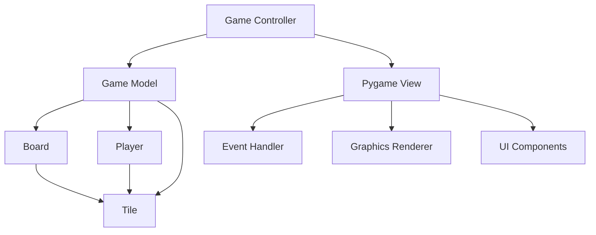

# Design Document

## Overview

The xoxo^2 game implementation will be built as a Python graphical application using pygame and object-oriented design principles. The system will manage a 4x4 game board where two players take turns in a three-phase move sequence: flip an existing tile, move it orthogonally, then place a new tile. The game emphasizes strategic tile management with limited resources (8 tiles per player) and dual-sided tiles that can change the game state dynamically.

## Architecture

The application follows a Model-View-Controller (MVC) pattern:

- **Model**: Game state management, rules enforcement, and win condition checking
- **View**: Pygame-based graphical display and user interaction
- **Controller**: Game flow coordination and input validation



## Components and Interfaces

### Core Classes

#### Tile Class
```python
class Tile:
    def __init__(self, shape: TileShape, color: TileColor, owner: Player)
    def flip(self) -> None
    def get_current_color(self) -> TileColor
    def get_shape(self) -> TileShape
    def get_owner(self) -> Player
```

**Responsibilities:**
- Store tile state (shape, current color, owner)
- Handle color flipping between red and green
- Maintain immutable owner and shape properties

#### Board Class
```python
class Board:
    def __init__(self, size: int = 4)
    def place_tile(self, position: Position, tile: Tile) -> bool
    def remove_tile(self, position: Position) -> Tile
    def get_tile(self, position: Position) -> Optional[Tile]
    def get_valid_moves(self, position: Position) -> List[Position]
    def is_position_empty(self, position: Position) -> bool
    def check_three_in_row(self) -> List[ThreeInRowResult]
    def can_opponent_break_three_in_row(self, three_in_row: ThreeInRowResult, opponent: Player) -> bool
    def is_full(self) -> bool
```

**Responsibilities:**
- Manage 4x4 grid state
- Validate tile placement and movement
- Calculate orthogonal movement options
- Detect three-in-a-row formations
- Evaluate if opponent can break three-in-a-row on next turn
- Track board occupancy

#### Player Class
```python
class Player:
    def __init__(self, name: str, shape: TileShape, tiles_remaining: int = 8)
    def use_tile(self) -> Tile
    def get_tiles_remaining(self) -> int
    def can_place_tile(self) -> bool
    def get_shape(self) -> TileShape
```

**Responsibilities:**
- Track remaining tile count
- Generate new tiles with player's shape
- Validate tile placement capability

#### Game Class
```python
class Game:
    def __init__(self)
    def start_game(self) -> None
    def make_move(self, move: Move) -> MoveResult
    def get_current_player(self) -> Player
    def is_game_over(self) -> bool
    def get_winner(self) -> Optional[Player]
    def get_game_state(self) -> GameState
    def check_win_after_move(self) -> Optional[Player]
    def simulate_opponent_responses(self, three_in_row: ThreeInRowResult) -> bool
```

**Responsibilities:**
- Coordinate overall game flow
- Enforce turn-based mechanics
- Validate complete move sequences
- Determine game end conditions with complex win logic
- Simulate opponent's ability to break three-in-a-row

#### PygameView Class
```python
class PygameView:
    def __init__(self, width: int, height: int)
    def render_board(self, board: Board) -> None
    def render_ui(self, game_state: GameState) -> None
    def handle_events(self) -> List[GameEvent]
    def highlight_valid_moves(self, positions: List[Position]) -> None
    def show_game_over(self, winner: Optional[Player]) -> None
```

**Responsibilities:**
- Render game board with tiles and colors
- Handle mouse clicks and keyboard input
- Display game state information
- Provide visual feedback for valid moves
- Show win/draw conditions

### Data Models

#### Enumerations
```python
class TileShape(Enum):
    HEXAGON = "hexagon"
    STAR = "star"

class TileColor(Enum):
    RED = "red"
    GREEN = "green"

class GamePhase(Enum):
    FLIP_SELECTION = "flip_selection"
    MOVE_SELECTION = "move_selection"
    TILE_PLACEMENT = "tile_placement"
    GAME_OVER = "game_over"
```

#### Move Structure
```python
@dataclass
class Move:
    flip_position: Optional[Position]
    move_to_position: Optional[Position]
    place_position: Position
    
@dataclass
class Position:
    row: int
    col: int
    
@dataclass
class GameState:
    board: Board
    current_player: Player
    phase: GamePhase
    move_count: int
    winner: Optional[Player]

@dataclass
class ThreeInRowResult:
    positions: List[Position]
    color: TileColor
    direction: str  # "horizontal", "vertical", "diagonal"

@dataclass
class GameEvent:
    event_type: str  # "click", "key", "quit"
    position: Optional[Position]
    key: Optional[str]
```

## Game Flow Logic

### Turn Sequence
1. **First Move Exception**: Only tile placement allowed
2. **Standard Turn**:
   - Phase 1: Select tile to flip (must have valid movement options)
   - Phase 2: Choose destination for flipped tile (orthogonal only)
   - Phase 3: Place new tile (if tiles remaining)
3. **Turn Validation**: Ensure all phases complete successfully
4. **Win Check**: Evaluate board after each completed turn

### Movement Rules
- **Orthogonal Only**: Up, down, left, right movements
- **No Diagonal**: Diagonal movements explicitly forbidden
- **Empty Destination**: Target position must be unoccupied
- **Flip Prerequisite**: Can only flip tiles that have valid moves

### Win Conditions
- **Three in a Row**: Horizontal, vertical, or diagonal
- **Color Matching**: Must be same color, not same player
- **Survivability Check**: Win only if opponent cannot break the three-in-a-row on their next turn
- **Forced Win**: Win if opponent's move creates three-in-a-row for current player
- **Turn-Based Evaluation**: Check after each complete move sequence
- **Draw Condition**: Board full with no achievable wins

## Error Handling

### Input Validation
- Position bounds checking (0-3 for 4x4 board)
- Move sequence validation
- Tile availability verification
- Turn order enforcement

### Game State Validation
- Prevent moves on completed games
- Validate flip-move-place sequence integrity
- Ensure orthogonal movement compliance
- Check tile placement legality

### Error Recovery
- Clear error messages for invalid inputs
- Game state preservation on failed moves
- Graceful handling of edge cases
- User guidance for valid move options

## Testing Strategy

### Unit Tests
- **Tile Class**: Color flipping, state management
- **Board Class**: Placement, movement, win detection
- **Player Class**: Tile management, resource tracking
- **Game Class**: Turn coordination, rule enforcement

### Integration Tests
- **Complete Move Sequences**: Full flip-move-place cycles
- **Win Condition Detection**: All possible winning scenarios
- **Edge Cases**: Board boundaries, resource depletion
- **Game Flow**: Start to finish game scenarios

### Test Data
- **Predefined Scenarios**: Known winning positions
- **Edge Cases**: Corner movements, resource limits
- **Invalid Inputs**: Boundary testing, illegal moves
- **Performance**: Large number of moves, complex board states

## User Interface Design

### Pygame Window Layout
- **Game Board**: 4x4 grid with visual tiles
- **Tile Representation**: Graphical hexagons and stars with red/green colors
- **Player Info Panel**: Shows remaining tiles and current turn
- **Phase Indicator**: Current game phase (flip, move, place)
- **Valid Move Highlights**: Visual indicators for legal moves
- **Win/Draw Overlay**: Game end screen with results

### Visual Design
- **Board Size**: 600x600 pixel game area
- **Tile Graphics**: Distinct hexagon and star shapes
- **Color Scheme**: Clear red and green differentiation
- **Grid Lines**: Subtle borders between board positions
- **Hover Effects**: Highlight tiles on mouse hover
- **Click Feedback**: Visual confirmation of selections

### Interaction Model
- **Mouse Clicks**: Primary interaction method
- **Click Sequence**: Click to flip → click to move → click to place
- **Visual Feedback**: Highlight valid moves at each phase
- **Error Indication**: Visual cues for invalid moves
- **Game Controls**: Restart button, quit option

### Graphics Assets
- **Tile Shapes**: Vector-based hexagon and star graphics
- **Color Variants**: Red and green versions of each shape
- **UI Elements**: Buttons, text displays, overlays
- **Background**: Clean, minimal board background
- **Animations**: Smooth tile movement and flipping effects